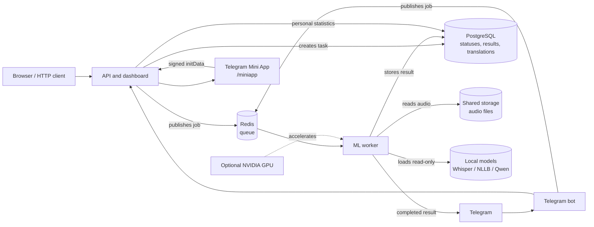

# Transcription Service

[Русский](README.ru.md) | **English**

An asynchronous service for audio transcription, text translation, and image text recognition. The project demonstrates the complete job flow: the HTTP API and Telegram bot accept a file, Redis delivers the job to an ML worker, and PostgreSQL keeps the shared status and result.

## Features

- Accepts audio through the HTTP API, Telegram, and an Omnitracker integration.
- Transcribes speech with Whisper, using either a local model or an external provider.
- Translates results with Gemini, DeepL, or local NLLB.
- Recognizes and describes images with Gemini Vision.
- Displays personal usage statistics in a Telegram Mini App.
- Runs API, worker, and Telegram bot as separate containers; CPU, NVIDIA GPU, and Kubernetes deployment manifests are supported.

## Architecture



In distributed deployments, PostgreSQL is the source of truth for tasks and translations, while Redis transports jobs. Local SQLite and `asyncio.Queue` are development fallbacks only, for a simplified single-process setup.

## Quick start with Docker Compose

### 1. Prepare the environment

```powershell
cd transcription
Copy-Item .env.example .env
```

Open `.env` and fill in only the integrations you need:

- `TELEGRAM_BOT_TOKEN` for the bot;
- `GEMINI_API_KEY` or `DEEPL_API_KEY` for the corresponding translation or vision backend;
- `TRANSLATION_BACKEND`, for example `gemini`, `deepl`, or `nllb_600m`;
- `POSTGRES_PASSWORD`: use your own password outside a demo environment.

Never commit `.env`: it contains secrets.

### 2. Optionally attach local models

By default, `MODEL_DIRECTORY=./models`. Put Whisper, NLLB, or Qwen model directories there, or set a different path. The worker mounts it read-only at `/app/data/models`.

`models/` can occupy tens of gigabytes and must not be included in a Docker image or Git. `data/`, which may contain local audio files, is also excluded from Git.

### 3. Start the CPU configuration

```powershell
docker compose up --build
```

This starts `api`, `worker`, `redis`, and `postgres`. The dashboard is available at `http://localhost:5000/`; the health endpoint is `http://localhost:5000/health`.

When using Compose, leave `REDIS_URL` blank in `.env`: Compose passes `redis://redis:6379/0` to containers automatically. For a local non-Compose run with an external Redis instance, use `REDIS_URL=redis://localhost:6379/0`.

### 4. Start the Telegram bot

```powershell
docker compose --profile telegram up --build
```

The profile adds the `bot` container. One Telegram token must be served by exactly one long-polling bot replica.

### 5. Use an NVIDIA GPU

After installing NVIDIA Container Toolkit, the GPU override switches the worker to a CUDA image, enables local NLLB-600M, and selects Whisper `large-v3`:

```powershell
docker compose -f docker-compose.yml -f docker-compose.gpu.yml up --build
```

To include the Telegram bot:

```powershell
docker compose --profile telegram -f docker-compose.yml -f docker-compose.gpu.yml up --build
```

The current profile targets an RTX 3050 with 4 GB VRAM. Qwen correction is disabled because loading a larger Whisper model, NLLB, and Qwen together can cause `CUDA out of memory`.

If a worker build is interrupted, rebuild only the worker without `--no-cache`; Docker will reuse completed layers:

```powershell
docker compose -f docker-compose.yml -f docker-compose.gpu.yml build worker
```

## Whisper Model Management

The service includes a web interface for managing Whisper models at `http://localhost:5000/models`.

**Features:**
- View the currently active model and its configuration (device, compute type, CUDA status)
- Switch between models at runtime without restarting the container
- Download new models from HuggingFace Hub directly from the UI

**Supported models:** tiny, base, small, medium, large-v1, large-v2, large-v3, distil-large-v2, distil-large-v3, distil-medium, distil-small

**API endpoints:**

| Route | Purpose |
| --- | --- |
| `GET /models` | Web UI for model management |
| `GET /api/models` | List all models with status (JSON) |
| `GET /api/models/info` | Get current model metadata |
| `POST /api/models/switch` | Switch active model (`{"model_size": "large-v3"}`) |
| `POST /api/models/download` | Download a model (`{"model_size": "large-v3"}`) |

**Quick start with large-v3:**
```powershell
# GPU deployment with large-v3 (default in docker-compose.gpu.yml)
docker compose -f docker-compose.yml -f docker-compose.gpu.yml up --build

# Or switch via UI after startup
# Navigate to http://localhost:5000/models and click "Download" then "Switch"
```

For CPU-only deployments, large-v3 requires ~6 GB RAM. Consider using `medium` or `distil-large-v3` for lower memory usage.

## Telegram Mini App

The Mini App displays a user's transcription, translation, and recent-task statistics. Send `/stats` to the bot and press **Open statistics**. With a configured URL, a menu button is also available.

Telegram requires a public HTTPS URL. Set the Mini App page address in `.env`:

```dotenv
WEBAPP_URL=https://stats.example.com/miniapp
```

Restart the bot after changing this value. The server validates the signature of `Telegram.WebApp.initData`; it never trusts a user identifier supplied by the browser.

For temporary local testing with Cloudflare Tunnel or ngrok, expose only `miniapp-gateway` on `127.0.0.1:5050`. It permits only `/miniapp` and protected `POST /api/miniapp/stats`; do not expose the full API directly on port 5000.

## Main API routes

| Route | Purpose |
| --- | --- |
| `POST /transcrib/` | Submit an audio file, `base64_data`, or an Omnitracker `uid`. |
| `GET /task/<task_id>` | Get task status and result. |
| `GET /task/` | Get task history for the dashboard. |
| `GET /translated/<task_id>/<language>` | Get or create a cached translation. |
| `GET /health` | Check API health. |

## Local development without Docker

For API-only development:

```powershell
python -m venv .venv
.\\.venv\\Scripts\\Activate.ps1
pip install -r requirements.txt
Copy-Item .env.example .env
python app.py
```

For an embedded worker, install the ML dependencies too:

```powershell
pip install -r requirements-worker.txt
python app.py
```

Local NLLB and Qwen dependencies are separated into `requirements-nllb.txt` and `requirements-qwen.txt`.

## Verification

```powershell
pip install -r requirements-dev.txt
python -m compileall .
pytest -q
```

## Kubernetes

Deployment manifests are in [`k8s/`](k8s). Production requires `ReadWriteMany` shared storage for audio and models, real secrets outside Git, and GPU resources available to worker nodes. See [`k8s/README.md`](k8s/README.md) for the detailed requirements and Docker Desktop limitations: its local Kubernetes cluster should not be treated as a guaranteed source of NVIDIA GPU devices.

## Security

- Never commit `.env`, `models/`, `data/`, virtual environments, or real Kubernetes secrets.
- TLS verification is enabled by default. Set `INTERNAL_TLS_VERIFY=false` only for a controlled internal endpoint with a self-signed certificate.
- Use your own PostgreSQL password and integration secrets for public deployments.
