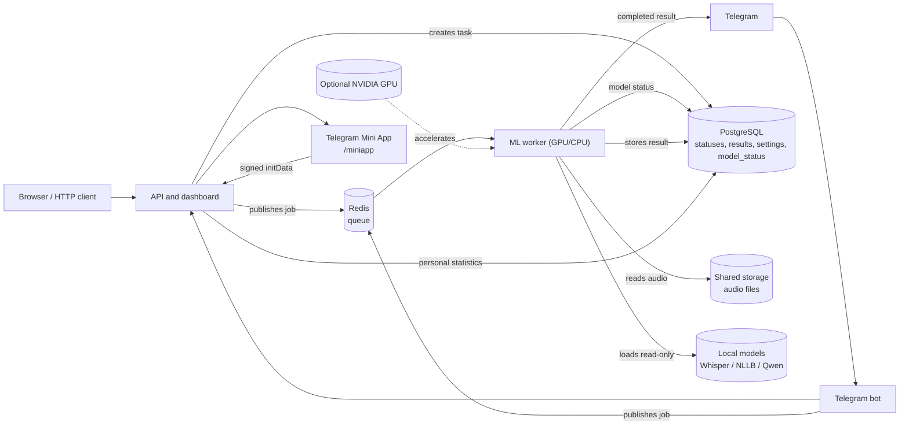

# Transcription Service v1.3

[Русский](README.ru.md) | **English**

An asynchronous service for audio transcription, text translation, and image text recognition. The project demonstrates the complete job flow: the HTTP API and Telegram bot accept a file, Redis delivers the job to an ML worker, and PostgreSQL keeps the shared status and result.

## Features

- Accepts audio through the HTTP API, Telegram, and an Omnitracker integration.
- **Web upload**: drag-and-drop file upload on Dashboard with progress bar and auto-polling of results.
- Transcribes speech with Whisper (faster-whisper/CTranslate2), using NVIDIA GPU or CPU.
- Translates results with Gemini, DeepL, or local NLLB.
- Recognizes and describes images with Gemini Vision.
- Displays personal usage statistics in a Telegram Mini App.
- **Settings persistence**: configuration stored in PostgreSQL, survives container rebuilds.
- **Model status sync**: worker reports GPU/CPU model status to PostgreSQL, displayed in API UI.
- Runs API, worker, and Telegram bot as separate containers; CPU, NVIDIA GPU, and Kubernetes deployment manifests are supported.

## Architecture



In distributed deployments, PostgreSQL is the source of truth for tasks, translations, settings, and model status. Redis transports jobs. Local SQLite and `asyncio.Queue` are development fallbacks only.

## Quick start with Docker Compose

### 1. Prepare the environment

```bash
cd transcription
cp .env.example .env
```

Open `.env` and fill in only the integrations you need:

- `TELEGRAM_BOT_TOKEN` for the bot
- `TELEGRAM_API_ID` and `TELEGRAM_API_HASH` for the local Bot API server (enables >20 MB files via Telegram)
- `GEMINI_API_KEY` or `DEEPL_API_KEY` for the corresponding translation or vision backend
- `TRANSLATION_BACKEND`, for example `gemini`, `deepl`, or `nllb_600m`
- `POSTGRES_PASSWORD`: use your own password outside a demo environment

Never commit `.env`: it contains secrets.

### 2. Optionally attach local models

By default, `MODELS_DIRECTORY=./models`. Put Whisper, NLLB, or Qwen model directories there, or set a different path. The worker mounts it read-only at `/app/data/models` via the `models-data` Docker volume.

`models/` can occupy tens of gigabytes and must not be included in a Docker image or Git. `data/`, which may contain local audio files, is also excluded from Git.

### 3. Start the service

```bash
# CPU mode
docker compose up -d --build

# With Telegram bot and local Bot API server
docker compose --profile telegram up -d --build
```

This starts `api`, `worker`, `redis`, `postgres`, and optionally `bot` + `telegram-bot-api`. The dashboard is at `http://localhost:5000/`; the health endpoint is at `http://localhost:5000/health`.

GPU is automatic: `Dockerfile.worker` uses `nvidia/cuda:12.6.2-cudnn-runtime-ubuntu22.04` and the compose reserves the GPU device. No separate GPU compose override needed.

### 4. Telegram bot with large file support

The compose includes a self-hosted Telegram Bot API server (`aiogram/telegram-bot-api`) that removes the 20 MB file size limit. Set `TELEGRAM_API_ID` and `TELEGRAM_API_HASH` in `.env` (from https://my.telegram.org/apps) and restart.

For files >20 MB, the bot will suggest uploading through the web interface (drag-and-drop on Dashboard) if the Telegram download fails.

## Web Interface

| Page | URL | Description |
| --- | --- | --- |
| Dashboard | `/` | Task queue, drag-and-drop file upload, auto-polling results |
| Models | `/models` | Whisper model management (download, switch, GPU/CPU status) |
| Settings | `/settings` | API keys, translations, integrations (persisted to PostgreSQL) |
| Mini App | `/miniapp` | Telegram Mini App with personal statistics |

## API Endpoints

| Route | Purpose |
| --- | --- |
| `POST /transcrib/` | Submit an audio file, `base64_data`, or an Omnitracker `uid` |
| `GET /task/<task_id>` | Get task status and result |
| `GET /task/` | Get task history for the dashboard |
| `GET /translated/<task_id>/<language>` | Get or create a cached translation |
| `GET /health` | Check API health |
| `GET /api/models` | List all Whisper models with download/active status |
| `GET /api/models/info` | Current model metadata (from DB) |
| `POST /api/models/switch` | Switch active model |
| `POST /api/models/download` | Download a model from HuggingFace |
| `GET /api/settings` | Get current settings (sensitive fields masked) |
| `POST /api/settings` | Update settings (persisted to PostgreSQL) |

## Telegram Mini App

The Mini App displays a user's transcription, translation, and recent-task statistics. Send `/stats` to the bot and press **Open statistics**. With a configured URL, a menu button is also available.

Telegram requires a public HTTPS URL. Set the Mini App page address in `.env`:

```dotenv
WEBAPP_URL=https://stats.example.com/miniapp
```

Restart the bot after changing this value. The server validates the signature of `Telegram.WebApp.initData`; it never trusts a user identifier supplied by the browser.

## Local development without Docker

For API-only development:

```bash
python -m venv .venv
.venv\Scripts\activate
pip install -r requirements.txt
cp .env.example .env
python app.py
```

For an embedded worker, install the ML dependencies too:

```bash
pip install -r requirements-worker.txt
python app.py
```

Local NLLB and Qwen dependencies are separated into `requirements-nllb.txt` and `requirements-qwen.txt`.

## Verification

```bash
pip install -r requirements-dev.txt
python -m compileall .
pytest -q
```

## Kubernetes

Deployment manifests are in [`k8s/`](k8s). Production requires `ReadWriteMany` shared storage for audio and models, real secrets outside Git, and GPU resources available to worker nodes. See [`k8s/README.md`](k8s/README.md) for the detailed requirements and Docker Desktop limitations.

## Security

- Never commit `.env`, `models/`, `data/`, virtual environments, or real Kubernetes secrets.
- TLS verification is enabled by default. Set `INTERNAL_TLS_VERIFY=false` only for a controlled internal endpoint with a self-signed certificate.
- Use your own PostgreSQL password and integration secrets for public deployments.
- Settings are stored in PostgreSQL, not in the container filesystem.
- The Telegram `initData` signature is always validated server-side.
