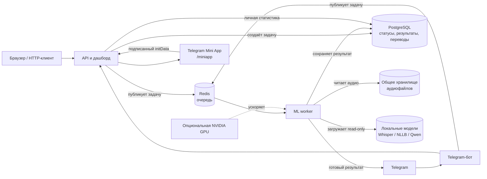

# Transcription Service

**Русский** | [English](README.md)

Асинхронный сервис для транскрибации аудио, перевода текста и распознавания изображений. Проект показывает полный путь задачи: HTTP API и Telegram-бот принимают файл, Redis передаёт работу ML-воркеру, а PostgreSQL хранит общий статус и результат.

## Что умеет

- Принимать аудио через HTTP API, Telegram и интеграцию Omnitracker.
- Расшифровывать речь через Whisper: локальную модель или внешний провайдер.
- Переводить результат через Gemini, DeepL или локальный NLLB.
- Распознавать текст и описывать изображения через Gemini Vision.
- Показывать личную статистику в Telegram Mini App.
- Запускаться раздельными контейнерами для API, worker и Telegram-бота; поддерживается CPU, NVIDIA GPU и заготовки для Kubernetes.

## Схема работы



В распределённом запуске PostgreSQL — источник истины для задач и переводов, а Redis — транспорт очереди. Локальная SQLite и `asyncio.Queue` предназначены только для упрощённой разработки без отдельных процессов.

## Быстрый запуск в Docker Compose

### 1. Подготовьте окружение

```powershell
cd transcription
Copy-Item .env.example .env
```

Откройте `.env` и заполните только нужные интеграции:

- `TELEGRAM_BOT_TOKEN` — если используете бота;
- `GEMINI_API_KEY` или `DEEPL_API_KEY` — для соответствующего backend перевода/vision;
- `TRANSLATION_BACKEND` — например, `gemini`, `deepl` или `nllb_600m`;
- `POSTGRES_PASSWORD` — задайте собственный пароль для не-демо окружения.

Не добавляйте `.env` в Git. В нём находятся секреты.

### 2. При необходимости подключите локальные модели

По умолчанию `MODEL_DIRECTORY=./models`. Положите локальные каталоги Whisper, NLLB или Qwen туда либо укажите другой путь. Контейнер worker подключит каталог как `/app/data/models` только для чтения.

`models/` может занимать десятки гигабайт и не должен попадать ни в Docker image, ни в Git. `data/` с локальными аудиофайлами также исключён из Git.

### 3. Запустите CPU-конфигурацию

```powershell
docker compose up --build
```

Будут запущены `api`, `worker`, `redis` и `postgres`. Дашборд доступен по `http://localhost:5000/`, проверка состояния — `http://localhost:5000/health`.

При Compose оставьте `REDIS_URL` пустым в `.env`: Compose сам передаёт контейнерам `redis://redis:6379/0`. Для локального запуска без Compose и с внешним Redis используйте `REDIS_URL=redis://localhost:6379/0`.

### 4. Запустите Telegram-бота

```powershell
docker compose --profile telegram up --build
```

Профиль добавляет контейнер `bot`; один токен Telegram должен обслуживаться только одним экземпляром long-polling бота.

### 5. Используйте NVIDIA GPU при наличии NVIDIA Container Toolkit

GPU-профиль переключает worker на CUDA-образ, включает локальный NLLB-600M и выбирает Whisper `small`:

```powershell
docker compose -f docker-compose.yml -f docker-compose.gpu.yml up --build
```

Для GPU вместе с Telegram-ботом:

```powershell
docker compose --profile telegram -f docker-compose.yml -f docker-compose.gpu.yml up --build
```

Текущий профиль рассчитан на RTX 3050 с 4 ГБ VRAM. Qwen-коррекция в нём отключена: одновременная загрузка крупного Whisper, NLLB и Qwen может привести к `CUDA out of memory`.

Если сборка worker была прервана, повторите только её без `--no-cache` — Docker сохранит завершённые слои:

```powershell
docker compose -f docker-compose.yml -f docker-compose.gpu.yml build worker
```

## Telegram Mini App

Mini App показывает персональную статистику транскрибаций, переводов и последних задач. В боте отправьте `/stats` и нажмите кнопку **«Открыть статистику»**; кнопка также доступна в меню при настроенном URL.

Telegram требует публичный HTTPS-адрес. Укажите в `.env` адрес страницы Mini App:

```dotenv
WEBAPP_URL=https://stats.example.com/miniapp
```

После изменения перезапустите bot. Сервер проверяет подпись `Telegram.WebApp.initData` и не доверяет идентификатору пользователя, переданному из браузера.

Для временной локальной проверки через Cloudflare Tunnel или ngrok публикуйте только `miniapp-gateway` на `127.0.0.1:5050`. Он пропускает лишь `/miniapp` и защищённый `POST /api/miniapp/stats`; не публикуйте напрямую полный API на порту 5000.

## Основные API-маршруты

| Маршрут | Назначение |
| --- | --- |
| `POST /transcrib/` | Принять аудиофайл, `base64_data` или Omnitracker `uid`. |
| `GET /task/<task_id>` | Получить статус и результат задачи. |
| `GET /task/` | Получить историю задач для дашборда. |
| `GET /translated/<task_id>/<language>` | Получить или создать кэшированный перевод. |
| `GET /health` | Проверить работоспособность API. |

## Локальная разработка без Docker

Для API без worker:

```powershell
python -m venv .venv
.\.venv\Scripts\Activate.ps1
pip install -r requirements.txt
Copy-Item .env.example .env
python app.py
```

Для встроенного worker дополнительно установите ML-зависимости:

```powershell
pip install -r requirements-worker.txt
python app.py
```

Для локального NLLB и Qwen предусмотрены отдельные файлы `requirements-nllb.txt` и `requirements-qwen.txt`.

## Проверка проекта

```powershell
pip install -r requirements-dev.txt
python -m compileall .
pytest -q
```

## Kubernetes

Манифесты находятся в [`k8s/`](k8s). Для production нужны общее хранилище `ReadWriteMany` для аудио/моделей, реальные секреты вне Git и доступные GPU на узлах worker. Подробные требования и ограничения Docker Desktop описаны в [`k8s/README.md`](k8s/README.md): локальный Kubernetes Docker Desktop не следует считать гарантированным источником NVIDIA GPU.

## Безопасность

- Не коммитьте `.env`, `models/`, `data/`, виртуальные окружения и реальные Kubernetes secrets.
- TLS-проверка включена по умолчанию; `INTERNAL_TLS_VERIFY=false` допустим только для контролируемого внутреннего endpoint с self-signed сертификатом.
- Для публичного запуска используйте собственные пароли PostgreSQL и секреты интеграций.
